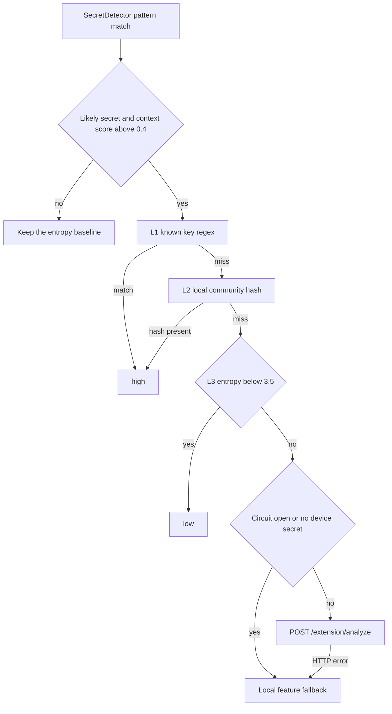

# LLM architecture — DotEnvy

This repository is the VS Code extension. The analysis service is external (`https://aegis.dotsuite.dev`). Its process, database, and deploy pipeline are not in this tree. There is no `python-llm` package, Railway config, Kubernetes manifest, or Terraform here.

The extension never sends a candidate to that service until cheaper local checks have passed.

## Components

| Piece | File | Role |
| --- | --- | --- |
| `LLMAnalyzer` | [src/utils/llmAnalyzer.ts](src/utils/llmAnalyzer.ts) | Singleton. Owns the service URL, the device secret, the local blacklist, and the four detection layers. |
| `signRequest` | [src/utils/llmSignedTransport.ts](src/utils/llmSignedTransport.ts) | HMAC-SHA256 over `` `${timestamp}.${body}` ``. |
| `FeatureExtractor` | [src/utils/featureExtractor.ts](src/utils/featureExtractor.ts) | 35-number vector. Index order must stay aligned with the service model. |
| `SecretDetector` | [src/utils/secretDetector.ts](src/utils/secretDetector.ts) | Calls `analyzeSecret` only after a pattern match that already looks like a secret. |
| `FeedbackManager` | [src/utils/feedbackManager.ts](src/utils/feedbackManager.ts) | Stores user labels locally and flushes them in batches of 20. |

`activate` calls `LLMAnalyzer.initialize` before other commands. Initialization loads the device secret from VS Code Secret Storage. If none is stored, it tries `POST /extension/register` and saves `client_secret`. It then pulls `GET /extension/blacklist`. A failed handshake does not block activation.

## Detection

`SecretDetector` reaches the analyzer only when `EntropyAnalyzer.isLikelySecret` is true and the context score is above `0.4`. `analyzeSecret` then runs four layers and returns `high`, `medium`, or `low`.

L1 matches a short list of known key shapes (AWS, Stripe, GitHub, OpenAI, Google) and returns `high` without a network call. If a variable name is present and a device secret exists, the extension also posts that entry’s hash to the blacklist.

L2 hashes `name` plus the first 8 characters of the value with SHA-256 and keeps the first 16 hex characters. A hit in the in-memory blacklist is `high`.

L3 uses feature index 7 (Shannon entropy divided by 8, then multiplied back by 8). Entropy below 3.5 returns `low` and never calls the service.

L4 posts `{ secret_value, context, variable_name }` to `/extension/analyze`. `is_likely_secret` with `risk_level` `high` or `critical` becomes `high`. Otherwise `enhanced_confidence` is mapped (`critical` and `high` to `high`). Three failures open a circuit for 60 seconds. While it is open, or when no device secret is loaded, the extension uses the local fallback: pattern score, entropy, and high-risk context or variable-name features. The same fallback runs when the HTTP call throws.

`GET /health` is unsigned and only updates the connected flag. It is not on the path of `analyzeSecret`.

## Requests the extension signs

Signed calls send `X-Extension-Timestamp`, `X-Extension-Signature`, and `X-Machine-ID`. The signature is HMAC-SHA256 of the timestamp, a dot, and the raw body, keyed with the device secret. Registration and `/health` are not signed.

| Call | Purpose |
| --- | --- |
| `POST /extension/register` | First-run device handshake. Stores `client_secret`. |
| `GET /health` | Connectivity probe. |
| `POST /extension/analyze` | L4 classification. |
| `GET /extension/blacklist` | Replace the local hash set. |
| `POST /extension/blacklist/add` | Contribute a hash after a local or remote `high`. |
| `POST /extension/blacklist/report_fp` | Report a false positive. `status: removed` drops the hash locally. |
| `POST /extension/feedback` | Upload a batch from `FeedbackManager`. |

The command `dotenvy.setupLLMSecret` can replace the device secret in Secret Storage. The service URL is fixed in `LLMAnalyzer` unless `setServiceUrl` is called.
