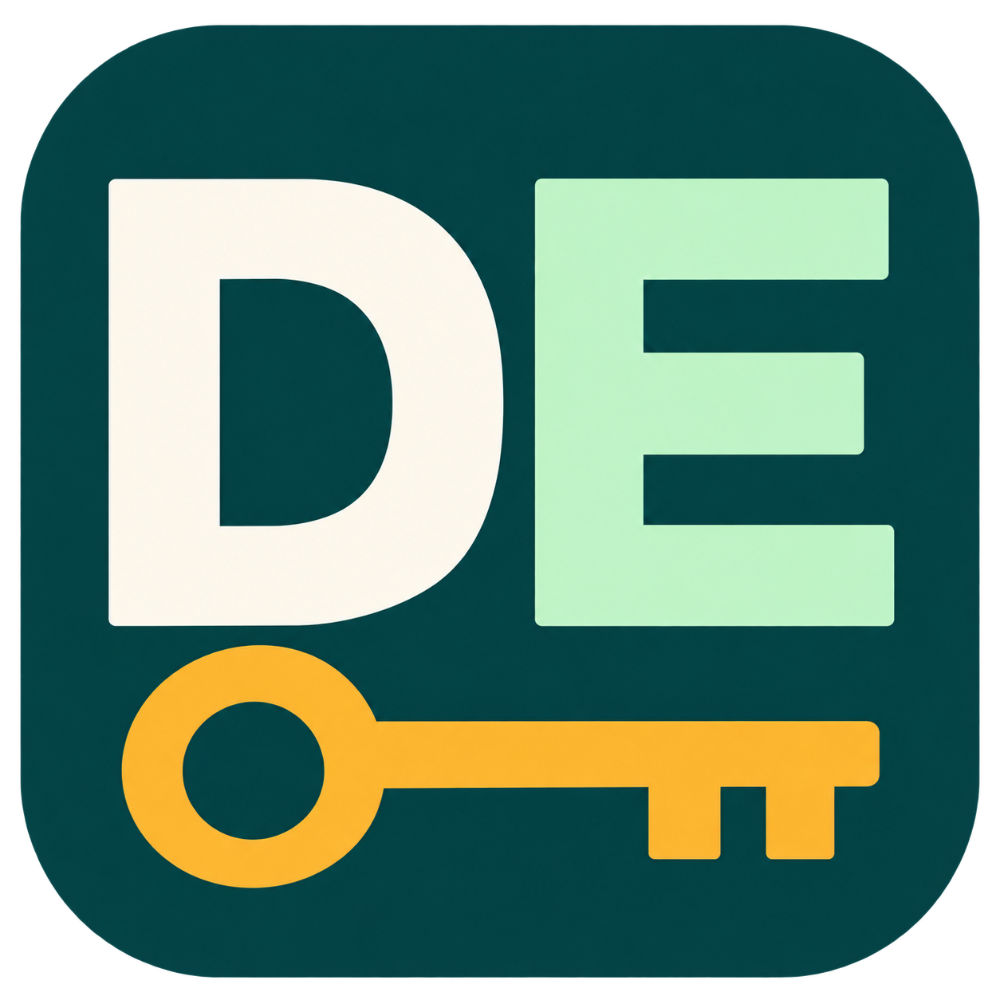

# dotenvy – VS Code Environment Manager

[](https://github.com/kareem2099/dotenvy/blob/main/package.json)
[](https://github.com/kareem2099/dotenvy/releases/tag/v2.2.2)
[](https://marketplace.visualstudio.com/publishers/FreeRave)
[](LICENSE)
[](https://marketplace.visualstudio.com/items?itemName=FreeRave.dotenvy)

<div align="center">
  
  <br />
  
</div>

🚀 **dotenvy** makes it effortless to manage and switch between your `.env` files directly inside VS Code. No more manual renaming or copy-pasting—just pick your environment and start coding immediately!

**[📥 Install from VS Code Marketplace](https://marketplace.visualstudio.com/items?itemName=FreeRave.dotenvy)** • **[📖 Documentation](https://github.com/kareem2099/dotenvy#readme)** • **[🐛 Report Issues](https://github.com/kareem2099/dotenvy/issues)**

---

## Privacy: local AI, local corrections, and the role of DotAegis

**Applies to the DotEnvy 2.2.4 source release. Older installed versions can behave
 differently; check your installed version.**

**DotEnvy classifies complete candidates locally. DotAegis remains the shared
training server: users can voluntarily contribute numeric corrections, and
clients download the resulting inference weights. Keys and source code are
never submitted by this version's scanner, feedback, or model-update client.**

### How detection and shared learning work

1. DotEnvy reads workspace files and identifies candidates. A partial pattern
   match inside a quoted value is expanded to the complete literal.
2. It extracts 35 numeric properties from that original value, sanitized
   surrounding context, and variable-name signals. These describe length,
   character distributions, entropy, provider patterns and contextual signals.
   The model takes these properties as input; it does not need the raw text.
3. A local worker runs DotAegis' feature-token transformer. The extension bundles
   synthetic bootstrap weights (about 916 KiB compressed), so scanning works
   without a server. Failed inference uses local heuristics, with no cloud fallback.
4. “Not a Secret” saves an immediate local negative correction. A successful
   “Move to .env” saves a positive correction, even if the original model said
   low confidence. The source is re-read and verified before moving a value.
5. **Community learning is off by default.** After the first successful move
   or false-positive correction, a one-time consent dialog offers to share the current correction
   and future corrections. Only explicit acceptance enables uploads: a random
   sample ID, schema number 2, 35 numbers, the user's action and chosen label. Earlier local corrections are
   not backfilled. Keeping corrections local or dismissing the dialog leaves
   sharing disabled and prevents repeated prompts, including after restarting.
   No candidate, source code, context string, variable name,
   file path, local fingerprint, complete-value hash or gradient is uploaded.
6. DotAegis authenticates that upload with an installation credential and queues
   it. Receipt is **not approval or immediate training**. An administrator reviews
   pending observations before training; arbitrary user feedback cannot directly
   change the shared model. Reviewed training updates the actual weights and
   saves a durable checkpoint with numeric replay and optimizer state.
7. DotAegis publishes the current trained inference weights at
   `GET /model/release`. DotEnvy checks at startup and hourly when model updates
   are enabled. It verifies checksum, feature schema, tensor shapes and finite
   values, starts a replacement worker, and clears scan caches after a successful
   switch. Bad updates leave the working local classifier in place.

The shared model can generalize from corrected patterns to other values with
similar properties. Local overrides handle that exact candidate immediately;
reviewed server training handles broader learning for everyone. Properties are
lossy, so two different values can look alike to the classifier. Improvements
must be measured on independent examples; neither feedback nor synthetic
validation guarantees fewer false positives in every project.

“Local” means VS Code's extension host. With Remote SSH or containers this can
be the workspace's remote machine/container, rather than your physical desktop.

### Settings and consent

| Setting | Default | Effect |
| --- | --- | --- |
| `dotenvy.secrets.enableCommunityLearning` | `false` | Share **new numeric corrections only**, using a registered installation and signed requests. |
| `dotenvy.secrets.enableModelUpdates` | `true` | Download shared weights at startup/hourly. Sends no scanner inputs or device authentication; HTTPS and hosting still expose normal connection metadata. |
| `dotenvy.secrets.enableCloudAnalysis` | Deprecated, ignored | Cannot re-enable complete-candidate uploads, even if an older version left it `true`. |

A one-time consent dialog appears **after** the first successful “Move to .env”
or “Not a Secret” action when sharing has not already been enabled or explicitly
disabled in Settings. The local action completes first. It explains precisely
what is shared and offers **Enable numeric learning** or **Keep corrections local**.
Acceptance includes the correction that triggered the dialog and future
corrections; earlier local history is never backfilled. Declining or dismissing
is remembered across later corrections and restarts.

Run **`DotEnvy: Toggle Community Learning (Numeric Feedback)`** to reopen consent
later or disable sharing. The setting can also be changed in VS Code Settings.
Disabling learning deletes pending numeric feedback locally and
prevents new submissions. It cannot retract an already submitted request or
remove server records/backups. Disable **both** new settings for an offline
secret scanner; bundled or previously downloaded weights still work.

Other features have their own network behavior: explicitly requested Doppler
push/pull transfers environment data to your configured account. VS Code,
extension update checks and other extensions are separate from this boundary.

### What is stored, and where

| Data | Handling |
| --- | --- |
| Complete candidate and source code | Read from existing workspace files and processed locally in memory; never included in this client's Aegis requests. Moving to .env writes a local file. |
| Detection/cache | Redacted display text, sanitized context, source location/digest and numeric features in local memory. Scan cache: five minutes, at most 1,000 file entries. |
| Local correction | A fingerprint derived from file, variable and complete-value digest, label/action and timestamp in VS Code state; at most 500 entries. No raw text or file names are stored in the correction record. |
| Pending community sample | Only when opted in: numeric features, label/action, schema and random ID in local VS Code state; at most 500. Acknowledged batches are removed; failed requests retry the same IDs, in batches of 20, at startup/after corrections/every five minutes. |
| Consent choice | VS Code state remembers that the one-time prompt was shown, including refusal/dismissal; the toggle command can reopen it later. |
| Installation credential | SecretStorage holds a service authentication credential, separate from workspace keys. Installation ID is in VS Code state. Existing credentials are preserved; registration occurs only when submitting opted-in feedback. |
| Downloaded model | Inference weights and manifest in extension global storage. One accepted downloaded release is retained alongside the bundled fallback. Replay records and optimizer state are never downloaded. |
| DotAegis community data | Installation ID/credential record and versions, numeric feedback/sample IDs and review status, reviewed numeric replay, optimizer/checkpoints and operational metadata can persist on the server. No automatic retention deadline or deletion guarantee is promised. |

**“No raw keys are sent by this client” is not “the server stores nothing.”**
Numeric properties disclose information about a value and are not guaranteed
anonymous or impossible to infer. Local hashes are not encryption. Hosting may
retain IP addresses, request paths/times, user-agent information and backups.
Checksums verify artifact consistency; HTTPS and the configured operator are
still trusted for model delivery. Model downloads contain data, not executable code.

Legacy raw-context and earlier feature queues are removed on upgrade rather than
silently uploaded. Existing service credentials and local corrections remain.
Older clients and administrator APIs can still submit full candidates; older
server records, hashes/votes, caches and backups are not erased by upgrading.
The privacy guarantees here describe this version's requests, not every legacy
API or the behavior of a separately modified build.

### Local correction scope and detection limits

Corrections apply to the same **file, extracted variable name and complete
value**. The latest decision replaces the previous one. Another file or changed
value does not inherit it. **`DotEnvy: Reset Local Secret Corrections`** clears
local overrides; it does not undo approved shared-model training or server data.

A classification estimates whether a value resembles a secret. It does **not**
verify that a provider issued it or that it is active, expired, revoked or has
particular permissions. False positives and missed secrets remain possible.
The bundled validation uses synthetic examples and is not a real-project accuracy
guarantee. Moving to .env does not revoke a credential or erase Git history.
Do not post live credentials or private source in support issues.
[LICENSE](LICENSE) contains the license and warranty terms; this description
adds no guarantee of complete detection or credential protection.

### توضيح بالعربي

**DotAegis ما اتشالش: دوره إنه يدرّب النموذج المشترك وينشر الأوزان المحسّنة.**
DotEnvy يفحص المفتاح كاملًا محليًا، ويستخرج منه ٣٥ خاصية رقمية. نفس الخصائص
هي مدخل النموذج؛ السيرفر مش محتاج نص المفتاح نفسه علشان يتعلم الأنماط.

«مش سر» يصحّح الكشف فورًا لنفس الملف والمتغير والقيمة. إذا فعّلت التعلم
الجماعي بإرادتك، التصحيحات الجديدة ترسل أرقام الخصائص والتصنيف فقط، مع معرف
عينة وهوية تثبيت للمصادقة. **لا مفاتيح، لا كود، لا مسارات، لا أسماء متغيرات،
ولا بصمة المفتاح في الطلب.** بعد أول نقل ناجح إلى `.env` أو اختيار «مش سر»، يظهر سؤال مرة واحدة بعد حفظ
القرار المحلي. تقدر توافق على مشاركة التصحيح الحالي والتصحيحات القادمة، أو
تختار «خلّي التصحيحات محلية». الرفض أو إغلاق السؤال محفوظ حتى بعد إعادة تشغيل
الامتداد؛ تقدر تغيّر رأيك لاحقًا من أمر تبديل التعلم الجماعي. التصحيحات المحلية
الأقدم لا تُرسل عند التفعيل.

السيرفر يستقبل العينة في انتظار المراجعة. بعد اعتمادها يتدرّب ويحفظ النموذج
وينشر أوزانه. DotEnvy ينزّل الأوزان عند البدء وكل ساعة، فيستفيد الجميع من
التعلم. تعطيل مشاركة التصحيحات لا يمنع الاستفادة من أوزان النموذج المشترك.
التعلم الجماعي مقفول افتراضيًا؛ تحديث الأوزان مفعّل افتراضيًا. أوقف الاثنين
إذا أردت ماسحًا دون اتصالات بالشبكة. لو السيرفر تعطل، الفحص المحلي يكمل.

**مش هنكتب «السيرفر مش بيخزن أي حاجة» لأنها معلومة غير صحيحة.** هو يحتفظ
بالخصائص الرقمية والتصنيفات وحالة المراجعة وهوية التثبيت والنموذج وسجلات
التشغيل المحتملة. الأرقام تكشف بعض خصائص القيمة وليست مضمونة إخفاء الهوية.
تعطيل المشاركة يمسح الطابور المحلي، لكنه لا يمسح ما وصل سابقًا للسيرفر.
الإصدارات القديمة قد ترسل القيمة كاملة عند تفعيل التحليل السحابي؛ راجع إصدارك.

النموذج يتعلم تمييز الأنماط لتقليل الإنذارات الغلط، لكنه لا يثبت صلاحية المفتاح
عند الشركة ولا يضمن اكتشاف كل سر. مشاركة Doppler منفصلة وتنقل بيانات البيئة
للحساب الذي تضبطه. الفحص في Remote SSH/container يعمل في بيئة الامتداد هناك.

---

## ✨ Features

### 🔄 **Environment Switching**
Effortlessly switch between `.env.development`, `.env.staging`, `.env.production`, or any custom `.env.*` file with a single click.

### 🌐 **Full Deep Internationalization (New in v2.2.1!)**
Native support for **English**, **Italian (`it`)**, **Arabic (`ar`)** (with full RTL support), and **Russian (`ru`)**, with a seamless sidebar dropdown to switch languages instantly across all dialogs, dashboards, and panels (Variable Manager, Trash Bin, History, Timeline, Analytics, and Secrets Scanner).

### 🎨 **Compact Sidebar & Onboarding Banner (New!)**
A modern, space-efficient sidebar design tailored for narrow split screens, complete with an interactive onboarding setup banner for newly opened repositories.

### ☁️ **Advanced Cloud Sync & Doppler Integration**
Bidirectional cloud sync with Doppler Secrets Manager, supporting multi-file prefix routing (`BACKEND_`, `FRONTEND_`), orphan key cleanup, and automatic project discovery.

### 📂 **Auto Detection & Sync**
Automatically scans your workspace for `.env` files and syncs seamlessly across multi-workspace setups.

### 🌿 **Git Branch Auto-Switching**
Automatically switch environments based on Git branch changes (develop → `.env.development`, staging → `.env.staging`, etc.)

### ✅ **Environment Validation**
Validate .env files for syntax errors, required variables, and type checking with custom regex patterns.

### 📄 **Diff View**
Compare environment files side-by-side before switching to preview changes and avoid surprises.

### 🛡️ **Git Commit Security & Monorepo Support**
Prevent committing sensitive data with pre-commit hooks that scan for secrets, validation errors, and block `.env` files, featuring smart git root discovery for monorepos.

### 💾 **Backup & Recovery**
Automatic backup creation before switching, with portable AES-256-GCM encrypted backups that work across any device.

### 📊 **Status Bar Integration**
Real-time environment indicator in status bar showing current configuration, validation status, and cloud sync state.

## 🚀 What's New in v2.2.0?

> ### 🌟 Community Spotlight & Thank You!
> A heartfelt thank you to **[@FaberVi](https://github.com/FaberVi)** for contributing PR [#2](https://github.com/kareem2099/dotenvy/pull/2), bringing full Italian localization, sidebar UX modernization, Doppler multi-file prefix mapping, and monorepo git hooks. We apologize for the delay in reviewing and integrating your PR while we were re-architecting the core security engine. Your contributions are now a proud part of DotEnvy!

### 🌐 Complete Italian Localization & Custom Switcher
DotEnvy is now fully localized into Italian across the entire extension! Every command, notification, and webview panel (including Variable Manager, Trash Bin, Timeline, History, Analytics, and Secrets Scanner) supports seamless, instant switching between English and Italian from the sidebar without restarting your editor.

### 🎨 Compact Sidebar Redesign & Toasts
Redesigned with a compact responsive layout for sidebars, plus clean in-panel toast notifications and progress bars.

### ☁️ Doppler Multi-File Sync & Cleanups
Easily split and merge Doppler secrets across multiple `.env` files using environment prefixes, with automatic orphan variable cleanup.

### 🗑️ Session Trash Bin (Lifesaver!)
Deleted a crucial variable by mistake? No worries. Restore it with a single click from the new Session Trash Bin.


### 🔍 Native VS Code Diff & History
Review your `.env` changes exactly like you review Git commits. 


### 📊 Environment Analytics
Track your usage, stability metrics, and most active environments directly from your dashboard.


### ⚙️ Compact Switcher & Settings
Manage all your environments seamlessly from a clean, native sidebar.


### 🧠 AI Secrets Guard 🔒

Local secret detection with optional shared learning, an interactive Secrets Panel and a bundled
trained transformer. See the [data-handling explanation](#privacy-local-ai-local-corrections-and-the-role-of-dotaegis).

#### Key Engine Features:
- **🔒 Offline Inference** — Bundled model runs in a local worker; no raw candidate submission or cloud fallback
- **35-Feature ML Model (fixed)** — Feature count corrected from 31 → 35, entropy normalization verified against shared Python/TypeScript fixtures
- **📋 Secrets Panel** — Full WebviewPanel shows all detected secrets (no more 5-item cap) with filter by confidence, search, View / Move to .env / Not a Secret buttons
- **🧠 Local Corrections** — "Not a Secret" and "Move to .env" remember decisions locally for the same file, variable, and value; reset them from the Command Palette.
- **🚫 .dotenvyignore** — New file (same syntax as `.gitignore`) lets you exclude files and folders from secret scanning
- **📝 Centralized Logging** — All extension logs visible in VS Code Output panel → DotEnvy
- **🔄 Smart Fallback** — Local fallback analysis uses all 35 features including variable name signals (e.g. `DB_PASS` increases risk even with low entropy)

### 🔒 Data Privacy & Security (Secrets Guard)
Classification and immediate corrections run locally. Optional community learning
sends numeric properties only; model updates download shared weights. Keys and
code are never submitted by the new scanner. See the [full privacy explanation](#privacy-local-ai-local-corrections-and-the-role-of-dotaegis)
for consent, server storage, offline settings and detection limits.

---

## 📋 Commands

All commands are accessible via the Command Palette (`Ctrl+Shift+P` / `⌘+Shift+P`).

### 🔄 Environment Manager
- **`DotEnvy: Switch Environment`** — Switch between `.env` files
- **`DotEnvy: Open Variable Manager`** — Open the full-page variable editor tab
- **`DotEnvy: Validate Environment Files`** — Validate for syntax errors and required variables

### 📊 Explorers & Analytics
- **`DotEnvy: View Environment History`** — View the dense history table and slide-over advanced filters
- **`DotEnvy: Open Trash Bin`** — Recover accidental deletions or changes in real-time
- **`DotEnvy: Open Analytics Panel`** — View heatmap and stability metrics
- **`DotEnvy: Open Timeline Panel`** — View the SVG timeline viewer tab

### 🛡️ Git Integration
- **`DotEnvy: Install Git Commit Hook`** — Block commits containing secrets
- **`DotEnvy: Remove Git Commit Hook`** — Remove the installed hook

### ☁️ Cloud Sync
- **`DotEnvy: Pull Environment from Cloud`** — Pull from Doppler
- **`DotEnvy: Push Environment to Cloud`** — Push to Doppler

### 🔍 Security
- **`DotEnvy: Scan for Secrets`** — Scan workspace for secrets (runs 100% locally by default)
- **`DotEnvy: Init .dotenvyignore`** — Create a pre-populated `.dotenvyignore` file
- **`DotEnvy: Toggle Community Learning (Numeric Feedback)`** — Enable/disable voluntary numeric corrections for shared training
- **`DotEnvy: Reset Local Secret Corrections`** — Clear remembered decisions and rescan without local overrides

### 🖱️ Right-Click (Explorer)
- **`DotEnvy: Ignore this path`** — Right-click any file or folder → add to `.dotenvyignore` instantly

### 💬 Support
- **`DotEnvy: Feedback & Support`** — Access feedback and support resources
- **`DotEnvy: Show What's New`** — View changelog for current version

---

## 🚫 .dotenvyignore

Control which files DotEnvy skips when scanning for secrets — same syntax as `.gitignore`:

```gitignore
# .dotenvyignore

# DotEnvy's own data (always recommended)
.dotenvy/**
.dotenvy-backups/**

# Test files (often contain example secrets)
**/*.test.ts
**/*.spec.ts
tests/**

# Docs with example secrets
docs/**
README.md
SECURITY.md

# Specific files
k8s/secrets.yaml
```

Run **`DotEnvy: Init .dotenvyignore`** to create a default file, or right-click any file/folder in the Explorer and choose **"DotEnvy: Ignore this path"**.

---

## 📦 Installation

### Quick Install
1. Open VS Code
2. Go to Extensions (`Ctrl+Shift+X` / `⌘+Shift+X`)
3. Search for "**dotenvy**"
4. Click **Install**

### Alternative Methods
- **[Download from VS Code Marketplace](https://marketplace.visualstudio.com/items?itemName=FreeRave.dotenvy)**
- **Manual**: Download `.vsix` file and install via VS Code

### Requirements
- VS Code **1.90.0** or later

---

## 🚀 Usage

1. Place your environment files in your project root:

   ```bash
   .env.development
   .env.staging
   .env.production
   ```

2. Open the **Command Palette** (`Ctrl+Shift+P`).

3. Run `DotEnvy: Switch Environment` and pick your environment.

4. The selected file is copied to `.env` automatically.

✅ The status bar updates to show the active environment.

---

## ⚙️ Configuration

```jsonc
// .dotenvy.json
{
  "environments": {
    "local": ".env.local",
    "qa": ".env.qa",
    "prod": ".env.production"
  },
  "gitBranchMapping": {
    "develop": "development",
    "staging": "staging",
    "main": "production"
  },
  "autoSwitchOnBranchChange": true,
  "validation": {
    "requiredVariables": ["API_KEY", "DATABASE_URL"],
    "variableTypes": {
      "PORT": "number",
      "DEBUG": "boolean",
      "API_URL": "url"
    }
  },
  "gitCommitHook": {
    "blockEnvFiles": true,
    "blockSecrets": true,
    "blockValidationErrors": true
  }
}
```

---

## ☁️ Cloud Sync Setup (Doppler)

```jsonc
{
  "cloudSync": {
    "provider": "doppler",
    "project": "your-project-name",
    "config": "development",
    "token": "dp.pt.your_token_here"
  }
}
```

---

## 🗺️ Roadmap & Contributing

For upcoming features, see [ROADMAP.md](ROADMAP.md).  
Issues and PRs are welcome! Please read [CONTRIBUTING.md](CONTRIBUTING.md) for details on our code of conduct, and the process for submitting pull requests to us.

---

## 👥 Contributors & Special Thanks

Special thanks to **[@FaberVi](https://github.com/FaberVi)** for authoring the Italian localization, custom dropdown language switcher, compact sidebar design, and Doppler multi-file sync improvements in PR #2.

---

## 📜 License

This project is licensed under the Apache License, Version 2.0 - see the [LICENSE](LICENSE) file for details.
## Local model release (v2.2.4)

The scanner uses feature schema 2 and bundles inference-only weights exported
from DotAegis' validated synthetic bootstrap. Model checksums and synthetic
validation metadata are included in `resources/models/aegis-v2.manifest.json`.
New numeric corrections can be uploaded with explicit opt-in. DotAegis reviews
these before training, and publishes updated inference weights for clients.

Validation: `npm ci`, `npm run compile`, `npm run lint`, and
`node test/run-all-tests.js`. Tests compare all class probabilities with Python,
exercise worker failures and corrupted models, block HTTP/fetch calls during
initialization and scanning even with legacy cloud enabled, verify scoped local
corrections/reset, authenticated numeric feedback retries and concurrent additions, post-action
consent acceptance/decline/dismissal and persistence,
model downloads/failure fallback, original-value .env writes and stale detections.
